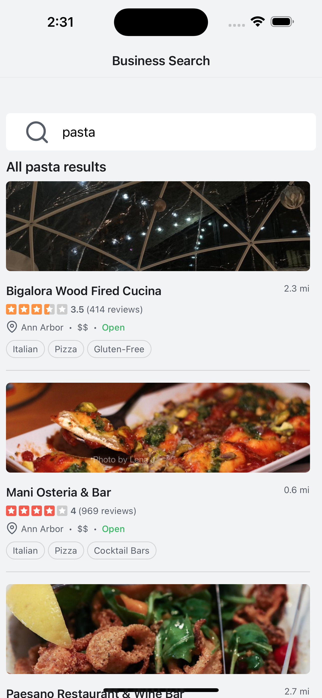

# Just a React Native Demo App

  

I've spent the last 7 years working on projects for corporate employers and thereby having none of the physical (virtual?) proof that I can do the things I've been doing when looking for new employment. Hence this repository here. It's really just a simple React Native app made with Expo that uses ideas from a tutorial mixed with things that I wanted to use (like Shopify's Restyle library). The business search data comes from Yelp's Fusion API service.
